# Pipeline 3 — 4-Channel Event Camera Drone Detection

## Full Pipeline Flowchart

```mermaid
flowchart TD
    A([START]) --> B

    %% ── INPUT ──────────────────────────────────────────
    subgraph INPUT["INPUT FILES"]
        B["7/Event/events.raw\n127MB · Prophesee EVT3 binary"]
        C["7/coordinates.txt\nor interpolated_coordinates.txt\n3007 bbox annotations"]
        D["7/Event/events.raw.tmp_index\nts_shift_us = 1,163,264 µs"]
    end

    %% ── STEP 1: EVT3 READER ────────────────────────────
    B --> E
    D --> E
    subgraph READER["STEP 1 · evt3_reader.py — EVT3Reader"]
        E["Read ASCII header\n(lines starting with %)"]
        E --> F["Read ts_shift_us\nfrom .tmp_index file"]
        F --> G["Stream binary words\n16-bit chunks · 4MB at a time"]
        G --> H{"word type\nbits 15–12"}
        H -->|"0x0 ADDR_Y"| I["set current_y"]
        H -->|"0x2 ADDR_X"| J["emit event\n(x, y, current_t, polarity)"]
        H -->|"0x8 TIME_HIGH"| K["new_time_high = bits[11:0] << 12\nnew < prev? → rollover_offset += 2²⁴\ncurrent_t = rollover_offset + time_high"]
        H -->|"0x6 TIME_LOW"| L["current_t = rollover_offset + time_high OR bits[11:0]"]
        I --> H
        K --> H
        L --> H
        J --> M["Structured numpy array\nfields: x, y, t, p\n(uint16, uint16, int64, uint8)"]
    end

    %% ── STEP 2: ANNOTATION LOADER ──────────────────────
    C --> N
    subgraph ANNOT["STEP 2 · dataset_builder.py — Annotations"]
        N["load_annotations()\nparse time_sec → t_us\nsort by timestamp"]
        N --> O["load_removed_windows()\nfind gaps > 50ms between annotations\n→ list of bad time ranges"]
    end

    %% ── STEP 3: WINDOW ITERATOR ────────────────────────
    M --> P
    subgraph WINDOWS["STEP 3 · iter_windows — 33ms Sliding Window"]
        P["T_DRONE_START_US\n= 9,800,000 + ts_shift_us\n= 10,963,264 µs raw\n= 9.8s synchronized"]
        P --> Q["iter_windows(33,333 µs)\nyield t_start, events[]"]
    end

    %% ── STEP 4: PER-WINDOW PROCESSING ─────────────────
    Q --> R
    subgraph PERWINDOW["STEP 4 · Per-Window Processing  ← loops ~3500×"]

        R{"events\nin window?"}
        R -->|"empty"| S["skip window\nn_empty++"]
        R -->|"has events"| T["t_sync = t_start − ts_shift_us\nconvert raw → synchronized time"]

        T --> U{"in removed\nwindow?"}
        U -->|"yes — bad region"| S
        U -->|"no"| V["find_annotation(t_sync)\nsearch coordinates.txt\nnearest within 100ms"]

        V --> W["apply fast_filter()"]

        subgraph FILTERS["STEP 4a · filters.py — Noise Removal"]
            W --> W1["Refractory Filter\nper pixel: if t − last_t[y,x] < 1ms → discard\nremoves hot pixels\n~2–6% removed"]
            W1 --> W2["BAF Filter\nfor each event: check 7×7 neighbourhood\nif no neighbour fired within 10ms → discard\nremoves isolated thermal noise\n~85–95% removed"]
        end

        W2 --> X{"events\nafter filter?"}
        X -->|"all removed"| S
        X -->|"ok"| Y["generate_channels()"]

        subgraph CHANNELS["STEP 4b · channels.py — 4-Channel Generation"]
            Y --> Y1["Ch1 · Positive Polarity\nevents where p=1\nnp.add.at(map, y,x, 1)\nnormalize 0–1\nleading edge — where drone is GOING"]
            Y --> Y2["Ch2 · Negative Polarity\nevents where p=0\nnp.add.at(map, y,x, 1)\nnormalize 0–1\ntrailing edge — where drone CAME FROM"]
            Y --> Y3["Ch3 · Rotor Frequency Map\ncount events per pixel\nkeep only pixels > 5 events in 33ms\n= ~150 Hz minimum\nspinning motor signature"]
            Y --> Y4["Ch4 · Time Surface\nfor each event: time_map[y,x] = t\nmost recent timestamp per pixel\nnormalize 0–1\nshows WHERE action is RIGHT NOW"]
            Y1 & Y2 & Y3 & Y4 --> Y5["np.stack → shape (4, 720, 1280)\nfloat32 · range 0.0–1.0"]
        end

        Y5 --> Z["determine split\nrandom() < 0.8 → train\nelse → val"]

        Z --> AA["Save 4-channel PNG\n(H,W,4) uint8 RGBA\nImage.fromarray(mode='RGBA')\ndataset/images/{split}/seq_t{t:012d}.png"]

        AA --> AB{"annotation\nfound?"}
        AB -->|"yes — drone visible"| AC["convert bbox → YOLO format\ncx,cy,w,h normalized 0–1\nwrite: 0 cx cy w h\ndataset/labels/{split}/seq_t{t:012d}.txt"]
        AB -->|"no — empty sky"| AD["write empty .txt\n= valid negative example\n(no drone in this window)"]

        AC & AD --> AE["next window →"]
        AE --> Q
    end

    %% ── STEP 5: DATASET YAML ───────────────────────────
    subgraph YAML["STEP 5 · Dataset Output"]
        AF["dataset/\n├── images/train/  ← ~370 4-ch PNGs\n├── images/val/    ← ~94 4-ch PNGs\n├── labels/train/  ← YOLO .txt files\n├── labels/val/\n└── dataset.yaml"]
        AG["dataset.yaml\nchannels: 4  ← tells YOLO to expect 4 channels\nnc: 1\nnames: ['drone']"]
    end

    AA --> AF
    AF --> AG

    %% ── STEP 6: TRAINING ────────────────────────────────
    AG --> AH
    subgraph TRAIN["STEP 6 · train_4ch_yolo.py — YOLO Training"]
        AH["Load YOLO11n base model\nyolo11n.pt · pretrained on COCO"]
        AH --> AI["patch_yolo_input_channels()\nmodel.model[0].conv\nConv2d(3→4, kernel 3×3)\nrescale weights: new[:,3,:,:] = mean(old)"]
        AI --> AJ["model.train()\ndata = dataset.yaml\nepochs = 100\nbatch = 8–16\nimgsz = 640\ndevice = GPU or CPU\npatience = 20\nresume from last.pt if interrupted"]
        AJ --> AK["Per epoch:\nforward pass → 4-ch image through patched YOLO\nloss = bbox_loss + cls_loss + dfl_loss\nbackprop → update weights\nvalidate on val split → mAP50"]
        AK --> AL["Save checkpoints\nruns/fred_4channel/weights/\n├── last.pt   ← resume point\n└── best.pt   ← best val mAP50"]
    end

    %% ── STEP 7: EVALUATION ─────────────────────────────
    AL --> AM
    subgraph EVAL["STEP 7 · evaluate.py — Results"]
        AM["Load best.pt"]
        AM --> AN["model.val(dataset.yaml)\nrun inference on val split\ncompute precision, recall, mAP50"]
        AN --> AO["Print results\nmAP50      : X.XX%\nmAP50:95   : X.XX%\nPrecision  : X.XX%\nRecall     : X.XX%"]
        AO --> AP["Compare vs baselines\nPipeline 1 event: ~87.68%\nPipeline 2 RGB  : ~76.23%\nPipeline 3 4-ch : target > 87.68%"]
    end

    AP --> AQ([END])

    %% ── STYLING ─────────────────────────────────────────
    style INPUT   fill:#1a1a2e,stroke:#4a90d9,color:#fff
    style READER  fill:#16213e,stroke:#4a90d9,color:#fff
    style ANNOT   fill:#16213e,stroke:#4a90d9,color:#fff
    style WINDOWS fill:#0f3460,stroke:#4a90d9,color:#fff
    style PERWINDOW fill:#1a1a2e,stroke:#e94560,color:#fff
    style FILTERS fill:#0d1b2a,stroke:#e94560,color:#fff
    style CHANNELS fill:#0d1b2a,stroke:#57cc99,color:#fff
    style YAML    fill:#0f3460,stroke:#57cc99,color:#fff
    style TRAIN   fill:#16213e,stroke:#f5a623,color:#fff
    style EVAL    fill:#1a1a2e,stroke:#f5a623,color:#fff
    style S fill:#c0392b,stroke:#922b21,color:#fff
```



---

## Key Numbers (Sequence 7)

| Stage | Count | Notes |
|---|---|---|
| Raw frames (33ms windows) | ~3,500 | full 118s recording |
| Pre-drone frames skipped | ~330 | countdown timer, t < 9.8s |
| Removed/bad windows skipped | ~50 | FRED Removed_frames gaps |
| Empty after filter | ~20 | windows with zero clean events |
| **Dataset frames** | **~3,100** | used for training |
| With drone (positive) | ~2,700 | bbox annotation present |
| Empty sky (negative) | ~400 | valid negative examples |
| Train split (80%) | ~2,480 | |
| Val split (20%) | ~620 | |

---

## Timestamp Alignment (Critical)

```
events.raw raw timestamps
    │
    │  raw_t = sync_t + ts_shift_us (1,163,264 µs)
    │
    ▼
T_DRONE_START_US = 9,800,000 + 1,163,264 = 10,963,264 µs  (raw)
                 =  9,800,000 µs  (synchronized)  ← matches coordinates.txt
    │
    │  t_sync = t_raw − ts_shift_us
    │
    ▼
find_annotation(t_sync)  ← compares against coordinates.txt times
in_removed_window(t_sync)  ← compares against annotation gaps
```

---

## The 4 Channels — Physics Intuition

```
Event stream (33ms window)
        │
        ├──► Ch1 Positive  →  pixel got BRIGHTER  →  leading edge of drone
        │                     where the drone IS NOW
        │
        ├──► Ch2 Negative  →  pixel got DARKER    →  trailing edge of drone
        │                     where the drone JUST WAS
        │
        ├──► Ch3 Rotor Map →  pixel fired >5×     →  ~150 Hz minimum
        │                     nothing in nature does this except spinning rotors
        │
        └──► Ch4 Time Surf →  last event time     →  most recent activity map
                               separates "just happened" from "earlier in window"
```

---

## Files Involved

| File | Role |
|---|---|
| `evt3_reader.py` | Parse EVT3 binary → numpy events |
| `filters.py` | Refractory + BAF noise removal |
| `channels.py` | Generate 4-channel stack |
| `dataset_builder.py` | Orchestrate all above, save PNGs + labels |
| `train_4ch_yolo.py` | Patch YOLO first layer, train |
| `evaluate.py` | Measure mAP50 vs baselines |
| `config.py` | All paths and hyperparameters |
